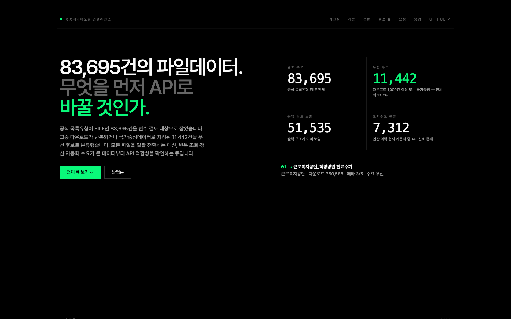

# Public Data Portal Intelligence

**Live page:** <https://hosungseo.github.io/public-data-portal-intelligence/>



공공데이터포털의 파일데이터를 전수 검토하고, 반복 조회·자동화 수요가 큰 항목부터 **API 전환 적합성**을 살펴보는 공개 리더입니다.

> 무엇을 무조건 API로 바꿀지가 아니라, 어떤 파일데이터가 API의 장점을 실제로 얻을지를 먼저 찾습니다.

## Current snapshot

2026-08-06 재산출 기준:

- 검토 후보 (`목록유형 == FILE`): **83,695건**
- 우선 후보 (다운로드 ≥ 1,000 또는 국가중점): **11,442건** — 13.7%
- 응답 필드 노출: **51,535건**
- 교차수요 관찰: **7,312건**
- 국가중점데이터: **1,583건**
- 제공기관: **1,101개**
- 관찰된 다운로드·API 이용 신호: **45,172,710건**

교차수요는 2024년까지의 연간 API 활용신청 이력을 우선 사용하고, 이력이 없으면 현행 목록 카운터를 보완 신호로 사용합니다.

## Source freshness

| 축 | 원천 | list_key | 적용 스냅샷 | 역할 |
|---|---|---:|---:|---|
| **U** | [공공데이터포털 목록개방현황](https://www.data.go.kr/data/15062804/fileData.do) | `15062804` | 2026-06-30 | 현행 목록·다운로드 카운터 |
| **M** | [공공데이터포털 목록 메타정보](https://www.data.go.kr/data/15121937/fileData.do) | `15121937` | 2026-07-03 | 포맷·주기·요청·응답 필드 |
| **Y** | [공공데이터 활용 현황(파일_API)](https://www.data.go.kr/data/15076332/fileData.do) | `15076332` | 2024-12-31 | 연간 다운로드·API 활용신청 이력 |

U·M은 2026년 현행 스냅샷이지만, Y는 공식 최신 연간본이 2024년 말 기준입니다. 페이지는 이 기준시점 차이를 각 카드와 후보 상세에서 명시합니다.

`UMY`는 세 출처 모두에 신호가 있다는 뜻이고, `UM-`는 이용이력이 없음을 뜻합니다. 원천별 기관명이 달라질 수 있어 파일 이용은 기관+목록명, API 교차수요는 정규화한 목록명을 보완키로 결합합니다.

## What changed in this release

- 원천 U를 2026-06-30, M을 2026-07-03 최신본으로 교체
- 후보 모집단을 추정 규칙 대신 공식 `목록유형 == FILE`로 고정
- 현재 파일 다운로드 수를 API 신청 수로 중복 집계하던 이전판 오류 제거
- API 목록의 `_API`·`OpenAPI` 접미어와 이용이력 기관명 차이를 보정해 교차수요 매칭 개선
- 원천 최신성 카드와 이전판 대비 변경 지표 추가
- 전체/우선 후보/국가중점 범위 필터 추가
- 목록키가 있으면 검색 결과가 아닌 공공데이터포털 원문으로 직접 연결
- 각 행에 이용이력 기준연도 또는 현재 카운터 기준을 표시
- 전환 요청 전 구조·최신성·권리·운영 4개 검토 게이트 추가
- 재현 가능한 표준 라이브러리 기반 갱신 스크립트 공개

이전판 대비 숫자 변화는 최신 원천 교체와 방법론 보정이 함께 반영된 값이라 순수한 시계열 증감으로 해석하면 안 됩니다.

## Selection model

### 1. 검토 모집단

- 공식 카탈로그 `목록유형`이 `FILE`인 목록키 83,695건
- API로 분류된 행은 제외
- 모든 후보를 큐에 유지하고 우선 후보를 별도 플래그로 표시

### 2. 우선 후보

- 다운로드 신호 1,000건 이상, 또는
- 국가중점데이터 (`국가중점여부 == "Y"`)

### 3. 검토 레인

- **즉시 검토 가능** — 응답 필드가 있고 메타정보가 4/5 이상
- **교차수요 확인** — 연간 이력 또는 현행 카운터에서 API 신청 신호 관찰
- **이력 재검증 필요** — 목록·메타는 있으나 이용이력 없음
- **수요 우선** — 그 외 수요·정책 신호 중심 후보

### 4. shortlist 점수

수요 신호, 응답 필드, 메타정보, 3종 결합, 국가중점, 포털 호스팅, 이용허락 제약을 함께 반영하고 한 기관이 상위 12건을 독점하지 않도록 최대 2건으로 분산합니다.

순위는 전환 결정이 아닙니다. 실제 요청 전에는 [Transition Request Packet v2](docs/TRANSITION-REQUEST-PACKET.md)의 구조·최신성·권리·운영 검토를 거쳐 `keep_file`, `file_and_api`, `convert_to_api`, `needs_evidence` 중 하나로 판단합니다.

## Page structure

1. 히어로와 KPI
2. 원천 최신성·이전판 대비 변경점
3. 선정 기준과 단계별 퍼널
4. 파일/API 이용 방식 비교
5. 균형형 shortlist 12건
6. 전체 83,695건 검토 큐와 범위·기관·레인·포맷 필터
7. 결합·포맷·갱신주기·기관 분포
8. 전환 요청 4개 검토 게이트
9. 방법론과 공개 범위

## Rebuild

Python 3 표준 라이브러리만 사용합니다. 원천 CSV는 저장소에 커밋하지 않습니다.

현재 원천을 자동 발견·다운로드해 자산을 다시 만들기:

```bash
python3 scripts/refresh_reader.py \
  --source-dir .cache/sources \
  --output-dir output \
  --download \
  --baseline output/file_to_api_summary.json
```

이미 받은 `U_*.csv`, `M_*.csv`, `Y_*.csv`로 재산출:

```bash
python3 scripts/refresh_reader.py \
  --source-dir /path/to/sources \
  --output-dir output \
  --baseline /path/to/previous/file_to_api_summary.json
```

산출물 간 개수·플래그·목록키 일관성 검증:

```bash
python3 scripts/validate_reader.py
```

## Published assets

- `index.html`, `file-to-api.html` — 동일한 공개 페이지
- `file-to-api.js` — 렌더링·검색·필터·상호작용
- `output/file_to_api_summary.{json,js}` — KPI·분포·shortlist·출처 최신성
- `output/file_to_api_index.{json,js}` — 전체 83,695건 컬럼형 경량 인덱스
- `scripts/refresh_reader.py` — 공식 원천 발견·다운로드·결합·산출
- `scripts/validate_reader.py` — 공개 자산 간 무결성 검증
- `docs/TRANSITION-REQUEST-PACKET.md` — 후속 검토 패킷 v2

포털 원천 CSV, 결합 중간파일, 개인 키는 포함하지 않습니다.

## Design and accessibility

- 순검정 배경과 네온 녹색 포인트의 기존 시각 언어 유지
- native `<details>` 행 펼침, 키보드 포커스, `prefers-reduced-motion` 지원
- 넓은 화면과 모바일에서 필터·카드가 각각 재배치되는 반응형 구성
- 최신성과 방법론 보정을 시각적으로 분리해 숫자의 기준시점을 숨기지 않음

## Caveats

- 다운로드·활용신청은 수요 신호이지 API 전환의 편익 확정치가 아닙니다.
- 동일·유사 API 존재 여부는 목록명 정규화만으로 확정할 수 없으므로 사람 검토가 필요합니다.
- 대용량 원본 배포나 일회성 분석은 파일이 더 적합할 수 있습니다.
- 개인정보, 제3자 권리, 갱신 SLA, 호출량·버전·장애 대응은 전환 요청 전에 별도로 검토해야 합니다.
